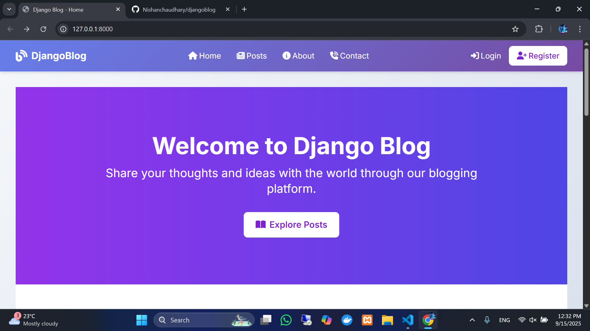

## Django Blog

Django Blog is a modern, responsive blogging platform that allows users to create, manage, and share content effortlessly. Built with Django framework, it incorporates Summernote editor for rich content creation and supports social authentication via Facebook and Google.

## ✨ Features
## 🔐 Authentication & Authorization
- User Registration & Login: Traditional email/password authentication system
- Social Authentication: Login via Facebook and Google OAuth2 providers
- Password Recovery: Secure password reset functionality

## 📝 Content Management
- Blog Creation: Rich text editor for composing blog posts
- Post Editing: Modify existing content with version history
- Delete Posts: Remove unwanted blog posts
- Categories & Tags: Organize content with categorization system
- Add Comments: Users can comment on blog posts
- Summernote Integration: Full-featured WYSIWYG editor
- Pagination: Efficient content browsing with paginated lists

